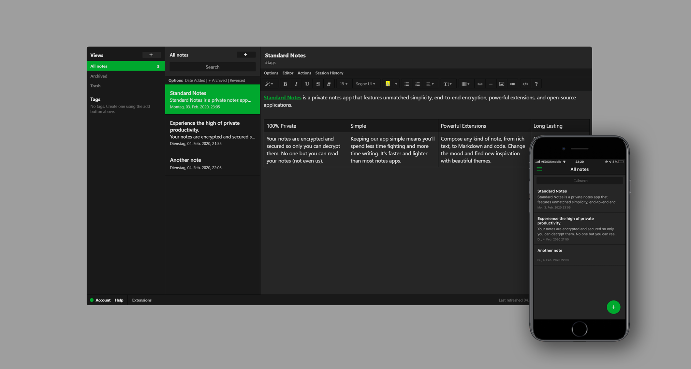

# Terminal dark theme for Standard Notes


[Standard Notes](https://standardnotes.org/) is a privacy-focused notebook for all platforms.<br><br>
Theme is inspired by colors from Daniel Ilin's [Evernote-style Dark Theme](https://github.com/ilindaniel/sn-theme-evernote-dark) and heavily based on the [gruvbox theme from Christian Hans](https://github.com/christianhans/sn-theme-evernote-dark).<br>
Standard Notes is not related to Evernote.

## How to install

Open "Extensions" in Standard Notes and click "Import Extension". Paste the following URL and press enter:

```
https://raw.githubusercontent.com/chegeiser/sn-theme-dark-terminal/master/ext.json
```
